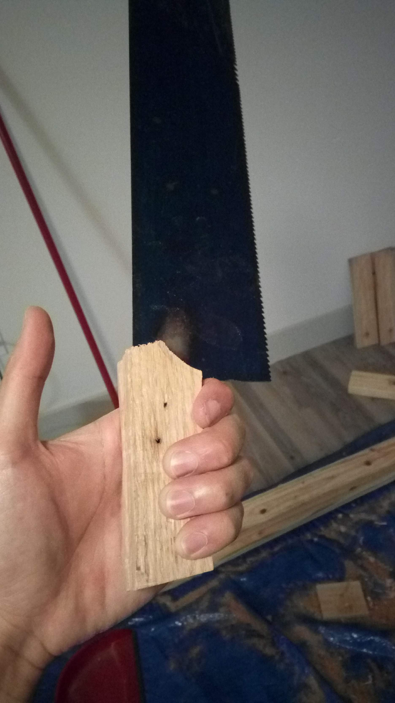
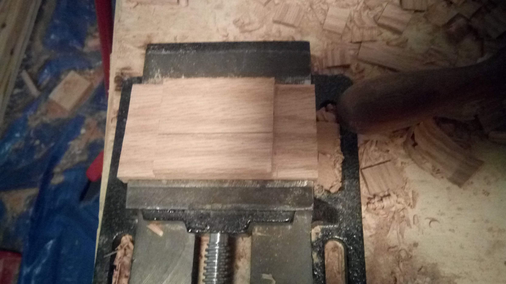
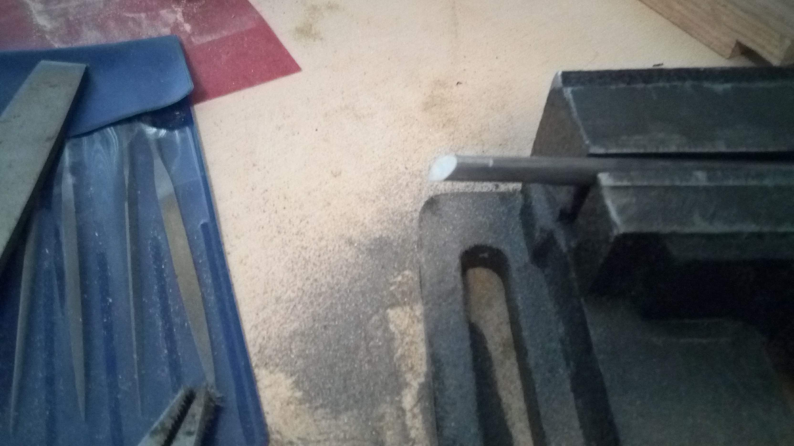

# Kind of longish box
So I made a box for a friend for her birthday

## Gluing the top half

I decided not to do anything fancy for the top half of the box, so it was just a matter of sawing the pieces to about the right length and planing them square

## Cutting the bottom joints (first try)
I wanted to do something a little fancier for the bottom half, so I tried to use dovetail joints to attach the sides to the bottom piece.
The gaps were larger than I liked, so I ended up scrapping this try and using butt joints to glue together the bottom half of the box.

This is basically my second attempt at using dovetail joints.
It definitely went better than my first attempt, but I got sloppy with cutting the edges that mates with the flat sides of the joint way too sloppily.
I followed [Paul Seller's How to Make a Dovetail Joint video](https://www.youtube.com/watch?v=OCYjoj6cfno), which seems to be the standard traditional way of cutting out dovetail joints.
Precision definitely is key here.
It also worked out, because I ended up using the poorly jointed piece to do some practice cuts for the engraving.

## Making a handle for my saw
So I cut a saw a couple years ago, and I never really bothered with making a handle for it.
I wrapped an old sock around the tang, and that's worked fairly well, but it was binding a lot while I was sawing these dovetails, so I finally bothered with making one.
It's made from red oak, with three short 1/8" steel dowels pinning it in place.

Rough cut of the handle stock

The saw's made from spring steel, so I immediately ran into problems trying to drill through it.
It turned out the issue was because I was trying to sandwich the tang between the wooden handle parts.
This was supposed to make sure the parts stayed perfectly aligned, but I guess the oak was just a little too soft and flexed enough to stop the drill bit from digging into the metal.

I also ended up tempering the handle to a dark brown, just to make it a little easier to drill through as well

Dry fitting the handle with the pins to check alignment.
I actually didn't bother gluing it together, so the final fit up was basically the same thing except with the blade in between the two halves

A little more work to improve the shape and it fits together nicely.
It's definitely a lot easier to grip than the sock

## Gluing the bottom half (second try)
So after the dovetail failure, I decided to do butt joints like I did on the top half.
This had the side benefit of making the engravable area larger because there weren't regions that would be taken up by dovetail pins.

I used a bench vice to size the top side to the exact same size as the bottom half.

Gluing up the top half

Planing the top half to get it to about the right size and to line it up with the bottom half

I think that's a pretty good fit with the bottom half

Another view

## Cutting the end caps
After the complete dovetail joint failure, I wanted to do at least some interesting woodwork in this project.
I chose to make a three sided lap joint to attach the ends on both halves of the box.
It'd add a little interesting contrast, and it's at least a better show of woodworking than using more butt joints

Sawing both halves to length in the vise.
It was pretty cool to see the gap between the two halves vanish where was a tight fit, like on the bottom edge of the second picture

It was pretty easy to saw some red oak to about the right size

I finished gluing up the first half before realizing I forgot to take any pictures to document the process

It was a pretty simple series of three cuts.
The first two set how the endcap would sit horizontally on the box ends, and the last cut would set how it'd sit vertically.
After sawing the first two cuts, I removed wood from the sides using a chisel, and then cleaned up the cheeks of the joint to get them closer to level, as you can see in the picture above.
Then it was a matter of repeating the process for the last side so it'd fit properly in the end.

It turned out a big issue on both halves was that the cuts setting the length of the box wasn't perfectly straight.
This meant that I needed to do more cutting to get the shape of the end caps to match to curved shapes of the box sides.
I couldn't do this very well on one end of this box half, so I filled in the gap with a little bit of scrap oak.
There's gaps on all sides of all the end caps, but I figured it wasn't worth the effort to try to fix it much further, especially given that I had a limited amount of end cap thickness to work with.

The extra width and height were sawn, chiselled, and/or sanded off

Sanding the faces flat

It's starting to look pretty good

## Making brass corner protectors
I added some brass protectors to keep the corners from getting chipped, and also because it just makes it look a little nicer.

I made a template out of some cereal box cardboard to mark out the corners on some brass.
I cut out one of them to check the size, and shrunk the template and remarked the parts after the first one ended up way too big

I cut all the pieces with a jeweler's saw and about 40 jeweler's saw blades.
It's really good that they come in packs of like 100

I stacked a bunch of the corners together in the vise and filed them to shape a few sides at a time.
It's really, really freaking cool to see the gaps between them disappear when you file a flat on top of a surface like this.
That's a stack of 4 of them in the picture

Four of them completed.
And by completed I mean basically halfway done, since they still need to be filed and bent into shape

Eight of them filed to shape.
By the way the thing in the background's the badly dovetailed bottom half.
Those big gaps are exactly why I didn't use it

Now the parts need two grooves filed into them.
I just marked this one using a pair of calipers and thought it looked really cool.
My goal's to file exactly where these caliper markings are.
These grooves both make it easier to bend them into shape, and also guide the bends to make sure they're about where I want them.
Ideally you'd spend some time to get the same depth of these cuts right, but it was just a couple of days before her birthday so I just eyeballed them so they had about a millimeter of material left.

I think this was a good choice, even though it four extra hours to get here.
First corner protector filed, bent, and fitted

All eight protectors finished

## Cutting the engraving tool
Now onto probably the most important/difficult/riskiest part of the project, engraving something on top of the box.
I had one shot to make it right, and obviously I can't make any mistakes that wouldn't show up as scratches on the box.
There was an instructable on inlaying brass on wood, and I basically followed their approach.
You carve out the areas you want to fill in with brass, pour brass powder over them, and apply some superglue.
The superglue ideally soaks into the brass and locks it in place.
Then you sand the surface back to flat, leaving the brass in the grooves but getting rid of the extra parts.

Of course I need a tool to cut those grooves.
I chose to make a bevel or V-cut graver, following the most common geometry I found online.
It's made from some random round steel stock I had laying around, without any hardening.
The V has an angle of 90 degrees, tilted ten degrees upwards, and the top side has a relief angle of I'm guessing 45 degrees.
I didn't take any pictures of it, but there were four stages to the cutting process.
First I cut the 10 degree slope on the heel (which is side that is facing the work) of the graver, then I cut the two bevels to get the 90 degree bevel, referencing the 10 degree flat so that the bevel's edge was centered on where the 10 degree flat used to be.
Then I filed the 45 degree relief on the top and sharpened all three sides using a sharpening stone.

## Engraving the top
First step was to get the top as close to flat as possible, so that sanding after inlaying's easier.
I applied a couple coats of finish first, to fill in all the wood pores, since they tended to fill in with brass and mess up the inlay overall on my test piece.
I chose to use superglue as the finish, because it apparently is a really durable finish, and I was already using it for the inlay work.
The major disadvantages are that it's very sensitive to moisture, requires special handling to avoid gluing yourself to the workpiece, and has some pretty noxious fumes.

Drew out the design and starting engraving.
There's nothing too special about the technique, just a tiny hammer and the graver

Finished the first pass of the engraving, it was really shallow so it was hard to get a good picture of it.
Now it's time to do a second pass to deepen and smooth out all the grooves

Second pass finished

Brass powder and superglue added.
I was concerned with how much contrast I could get based on what I saw on the test piece, but I was pretty happy with these results

Extra bits sanded down.
I'm pretty happy with the results

## Finished box

A few more coats of superglue, and sanding up to 2000 grit.
Added the hinges, latches, and corner protectors, and it's looking pretty good

