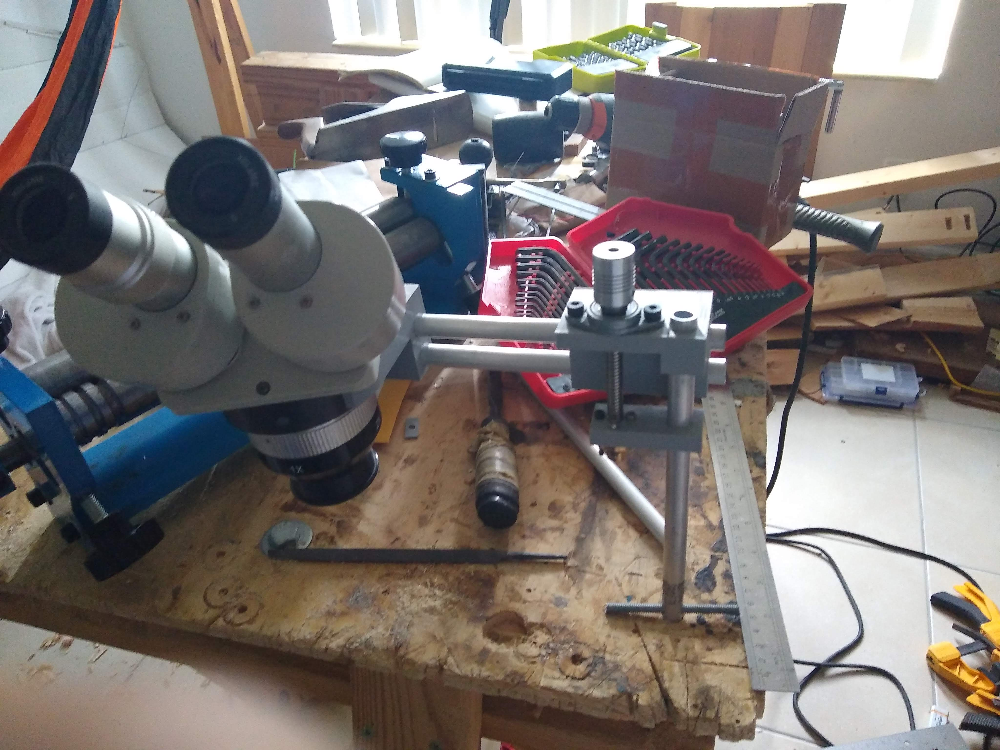
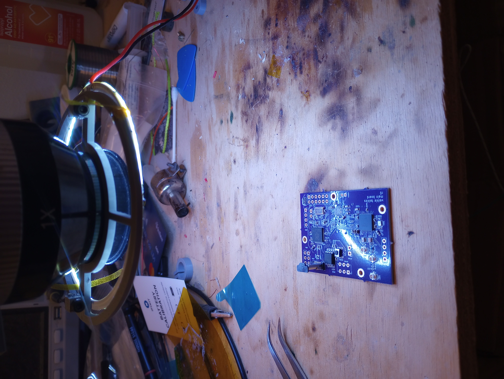
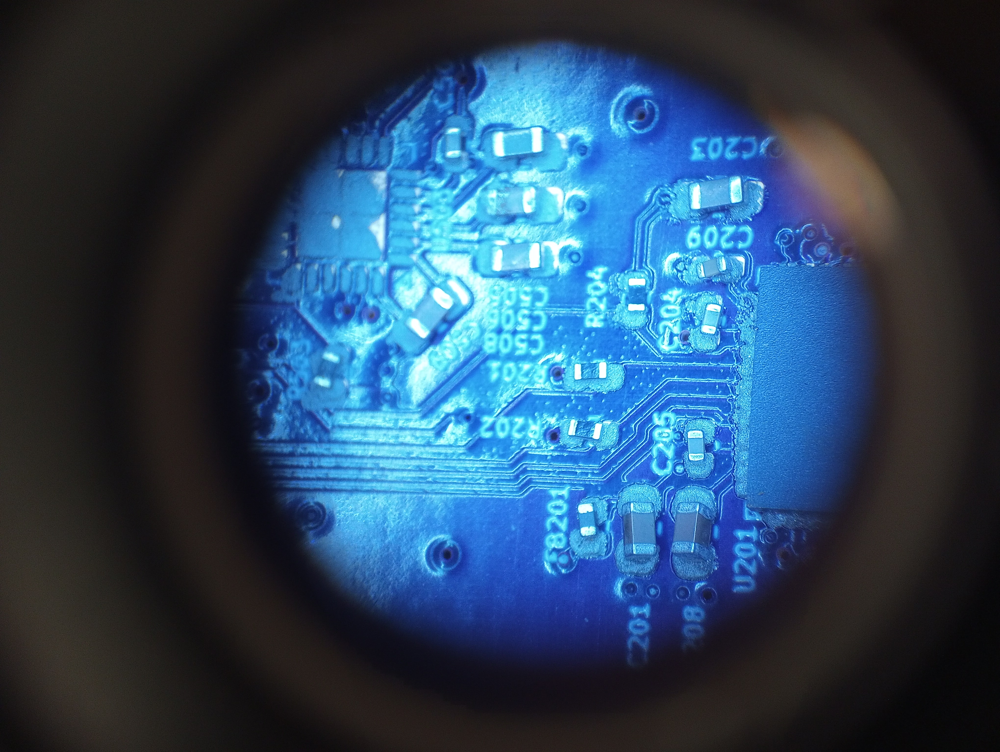
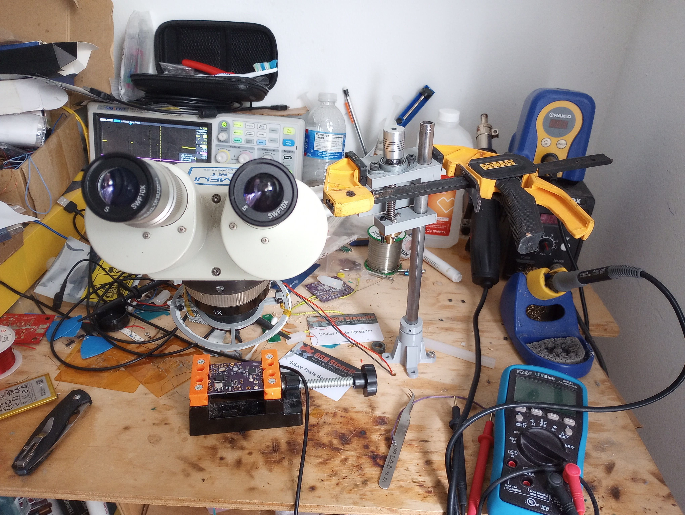

So work was throwing away this perfectly good binocular microscope, and I managed to nab it.
Here's just some pictures of the stand I made for it.
It has some knob for fine height adjustment using the lead screw from my CNC's old Z-axis assembly.
Aside from the fact it's almost collapsed from the weight of the stand it's working pretty well!
Mostly 3D printed parts but I'm thinking of adding in some Delrin inserts in the next revision to improve durability.
The files are at [https://git.threefortiethofonehamster.com/kelvin/microscope-stand](https://git.threefortiethofonehamster.com/kelvin/microscope-stand) in case anyone happens to stumble across a similar model microscope

Testing out one way to mount it on a table

How well it works with an automobile headlight ring light as illumination

Current configuration, with an clamp to keep it working until I redesign that part
