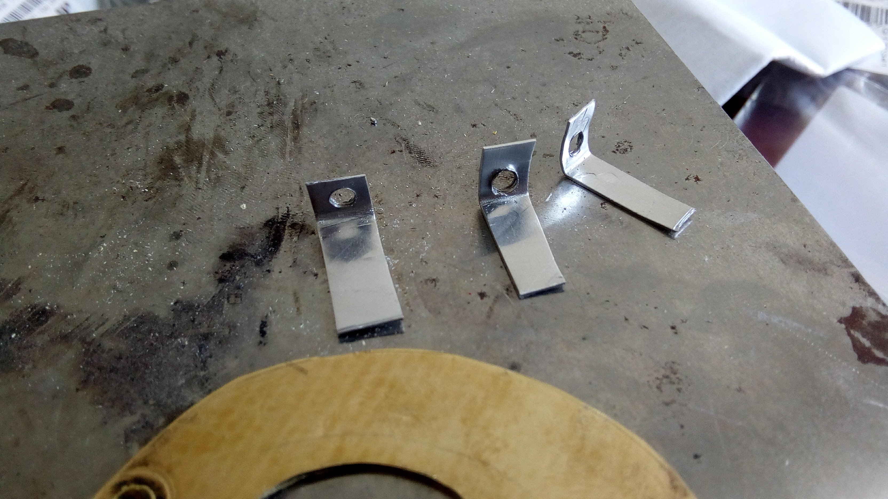

# Low end microscope setup
I've been messing with soldering smaller SMD components, so it seemed like a microscope setup would help out with inspecting the solder joints.
Like most of the projects I do, I tried to use fairly accessible parts so that it's easily repeatable and I can remake it when something breaks.
Also like usual I have close to no background knowledge in how to do it correctly, so what I'm doing is probably nowhere near best practice.

## First design
TODO add picture of the lens drawing if I can find it
My first thought was to try to make the entire optics system from stock store bought lenses.
I created a Python to apply the simpler equations for focus and magnification to find all the combinations of 2-3 lenses that would give me a positive magnification system that would be less than 300 mm from objective lens to eyepiece.
TODO link script here
I ended up choosing 3 identical biconvex lenses with a focal length of 25.4mm.
This seemed to be a pretty good setup, and having all of them being identical meant it'd be a lot easier to figure out how to put it together.
TODO look up exact theoretical stats
Of course, I was entirely wrong, mainly because of the two types of optical aberrations (chromatic and spherical) that I totally ignored while designing it.
I figured this out a little while later, so I'll let you see what I did before throwing out this approach

### Mounting on a ruler
Since I needed to place them at fairly precise distances from each other for it to work, I figured I might as well mount them all on a ruler
TODO add picture of the ruler

The image seemed alright, but not really good enough to use for the stuff I needed, but maybe it'd be good enough if I adjusted the distances a bit more and blocked out more of the ambient light?

### Mounting in some cardboard
I cut up some cardboard from a cereal box to make a slightly more adjustable microscope.
Each lens was mounted in its own tube using a little duct tape to hold it in using friction, and the top and bottom lenses slide inside the middle lens's tube.
Now I could tell that the lens setup just wasn't good enough for what I needed.
There were two major issues, the first of which came from the fact that all the lenses were relatively small and were simple spherical lenses.
This meant that they suffered from spherical distortion, so that the focus distance near the center of the image was different that what it was further out.
Stacking three of these lenses together meant that I could only see a very small section in the middle of the image at a time.

Secondly, the entire thing was REALLY sensitive to object distance.
If my hand moved like half a millimeter either way it'd be out of focus.

Basically I learned:
- the fewer the lenses, the better
- optics is hard, so use premade when possible
- using a digital camera at the end of the microscope instead of an eye is pretty nice (less eye strain and also the ideal focal length seems to be a bit shorter than a human eye, so it tends to work out better in all the equations)

So with all that in mind, I came up with a new approach

### Using a tablet as a microscope
So I found this attachment for phones and tablets that included a macro lens.
Basically all I'd need to do now was to increase the magnfication a bit, and I'd be good to go!
So I just duct taped one of the 25.4mm lenses on top of it and put it on an old tablet, and it worked!

TODO picture of prototype lens setup

Also I noticed that the tablet tended to block out light from illuminating what I was looking at, so I stuck an LED on the macrolens clip thing, and that seems to be good enough

After that initial success, I made a more permanent setup out of some brass, aluminum, and plywood.
The lens is held in place on the brass plate with a few set screws that are attached to the brass plate with three aluminum strip legs, and this whole contraption is held against (and also fixed to be pretty close to parallel to) the plywood bit with a few stainless steel rods I happened to buy 100 of a while ago
This works pretty well

There's still plenty of room for improvement:
- I'm currently powering the microscope LED of my lab power supply. It'd be nice to make a custom power supply for it
- The focal length is still kind of lacking; I have to hold the board pretty close to it for it to be in focus, so I definitely can't use it as is while I'm soldeirng. Maybe it'd make sense to add another lens of two to increase the focal length
- The stand I'm using doesn't hold it at the right height for a PCB to be in focus just sitting on my bench. I might try to make an adjustable stand for it eventually
