I made a nerf gun for my little brother's birthday out of some CNC cut plywood and a lot of plumbing parts.
It cost several times more than a normal nerf gun, takes much longer to reload, but it was probably worth it

# Mechanism
A normal nerf gun uses a spring to quickly compress a piston, and the air from that pushes the nerf dart out of the barrel.
This comes with a few design limitations.
The power of the nerf gun is limited to how strong and big you can make the piston and spring, and the spring mechanism limits accuracy at higher power because it inherently adds a kickback element to the firing action from the mass of the piston accelerating forward.
I decided to go with a design more akin to a PCP airgun, where the projectile is propelled by compressed air provided by a tank.

The design uses two tanks.
One is connected directly to the barrel via a ball valve, which is opened using a rubber band powered spring mechanism.
The second one is much larger, and is used so the user can take multiple shots before having to repump it.
It's connected to the first tank with a valve too, so the user only needs to open the valve for a short amount of time between shots to refill the first tank.

# Design
Each part was designed one section at a time.
After a run to Lowes I had a bunch of plumbing parts that fit together, and I designed the frame to hold the plumbing parts together from that, then moved on to how to hold the barrel and bolt assembly to that, and eventually got down to the trigger section.

There's only a few design parameters that weren't fixed at this point, being constrained by what I can easily get a hold of inexpensively, the barrel length and the volume of the first tank.
The volume of the second tank was fixed because I'd already chosen to use an old mini propane tank for a torch (that I already carefully purged of propane multiple times).
The barrel length could be easily adjusted later, so really the only important parameter to nail down was the size of first tank.
I had decided to make it from PVC pipe so that it'd be relatively easy to modify if needed, and chose to make it about half the length (and thus half the volume) of the barrel.
This seemed to provide enough volume so that it'd still provide plenty of pressure even at lower volumes, while not emptying the propane tank too quickly.

Later on it turns out this was less important than getting the ball valve to open fast enough; the velocity seemed to be heavily affected by the number of rubber bands pulling the valve open, so it's very likely that the nerf dart is already out of the barrel before it really sees the peak of the pressure from the first tank.

# Construction

## Plumbing assembly
As an apartment dwelling, I had no understanding of how threaded pipe worked before this project.
It turns out there are multiple standard sizes, so you need to be very careful to make sure all your fittings are from the same standard.
I also got really good at applying Teflon tape and retesting the system every step of the assembly process to make sure I hadn't added a new leak into the system.
It is really fascinating how compression fit fittings work so well

The first tank was made by fitting two PVC end pieces onto a length of PVC pipe, drilling a hole in one side for a brass fitting and epoxying that in place.

## Barrel support
My CNC couldn't cut a long enough piece of plywood to support the entire barrel, so the support piece ended up being several pieces glued together

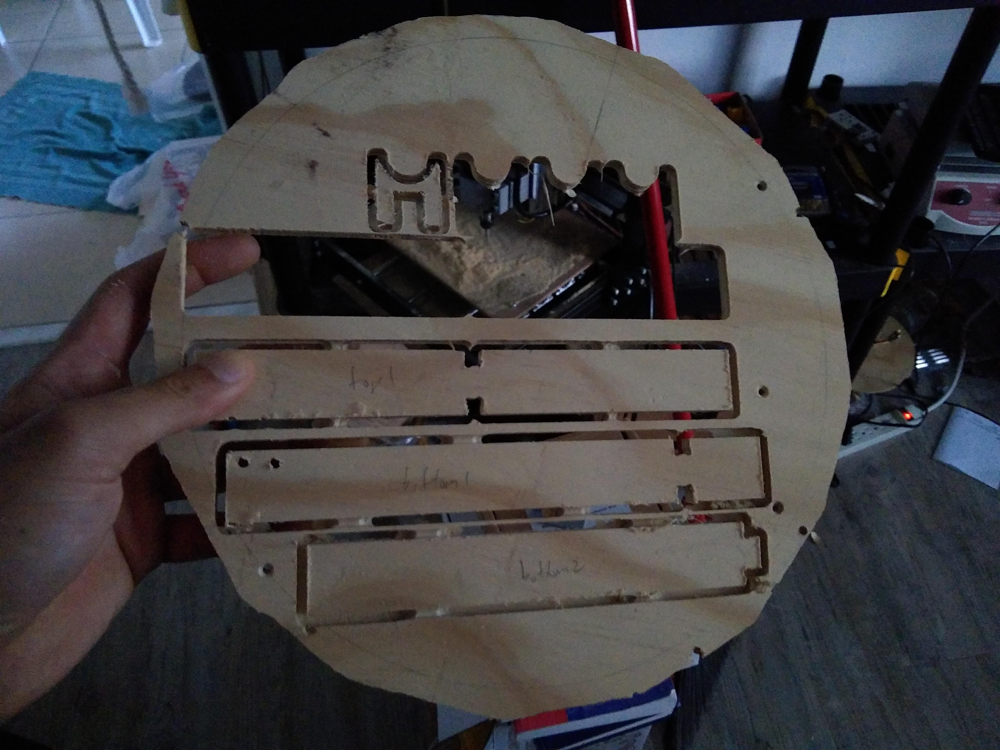

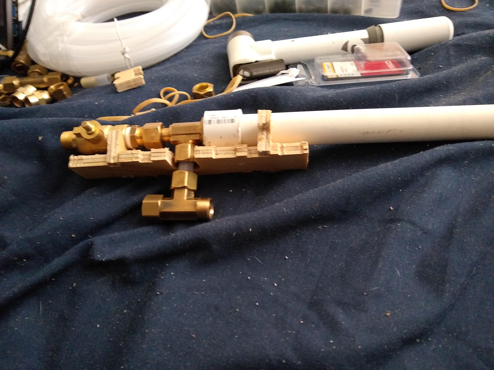

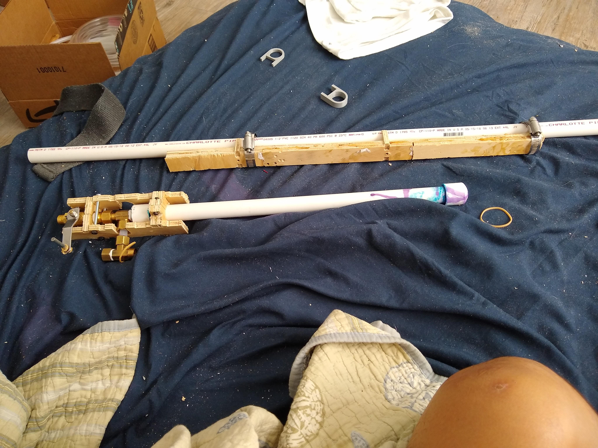

The 3D printed connector mating the barrel assembly to the plumbing parts was next

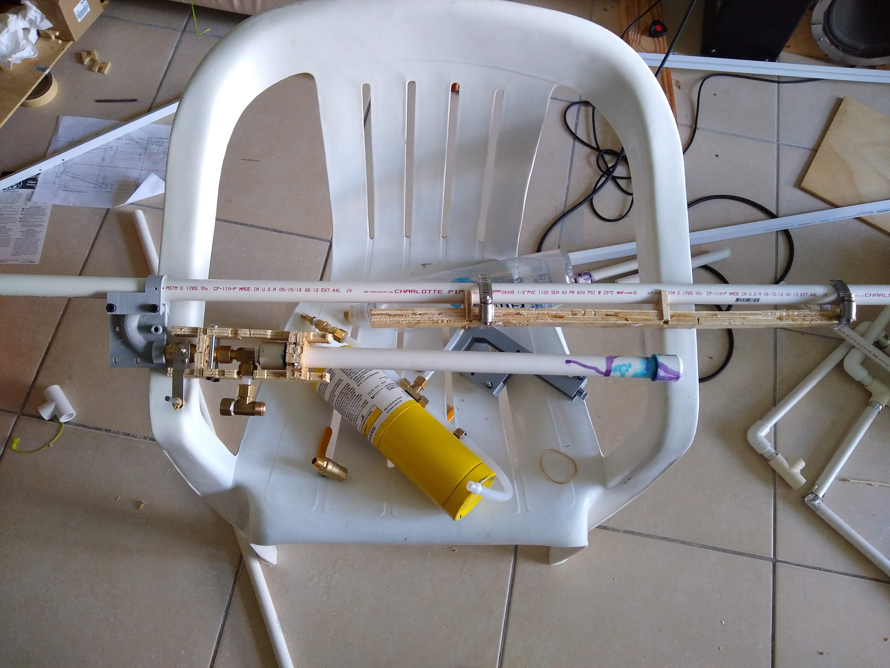

## Trigger assembly
The trigger assembly ended up going through two iterations.
In both instances there's one piece of plywood that keeps the ball valve from opening, while the second piece acts as the trigger piece the user pulls on, causing the first piece to release the ball valve.

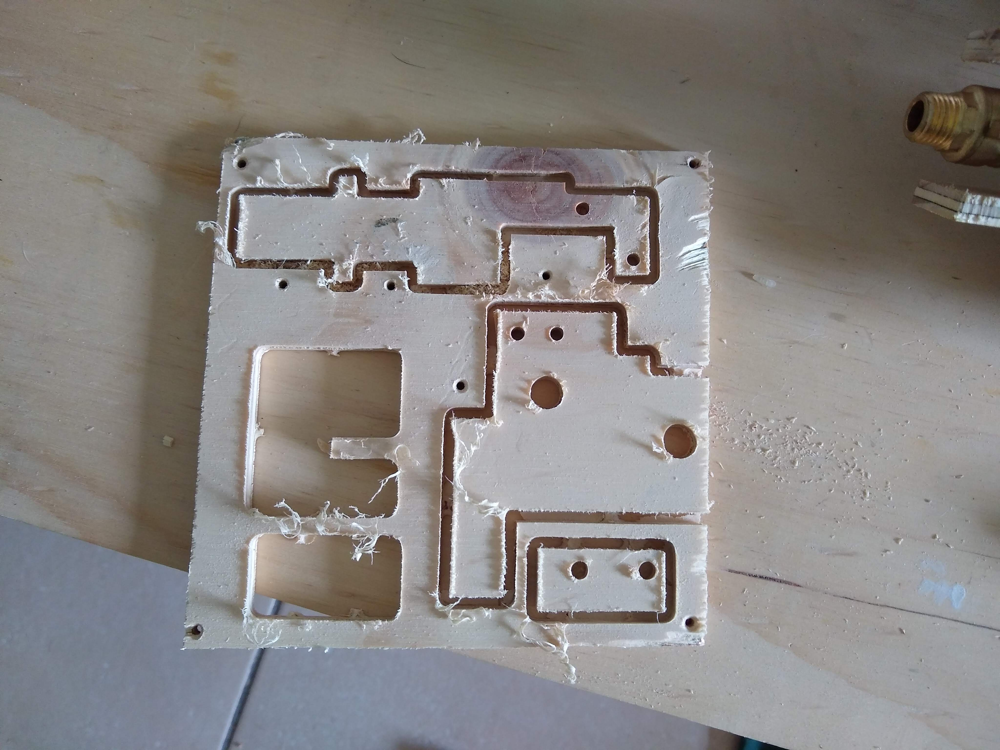

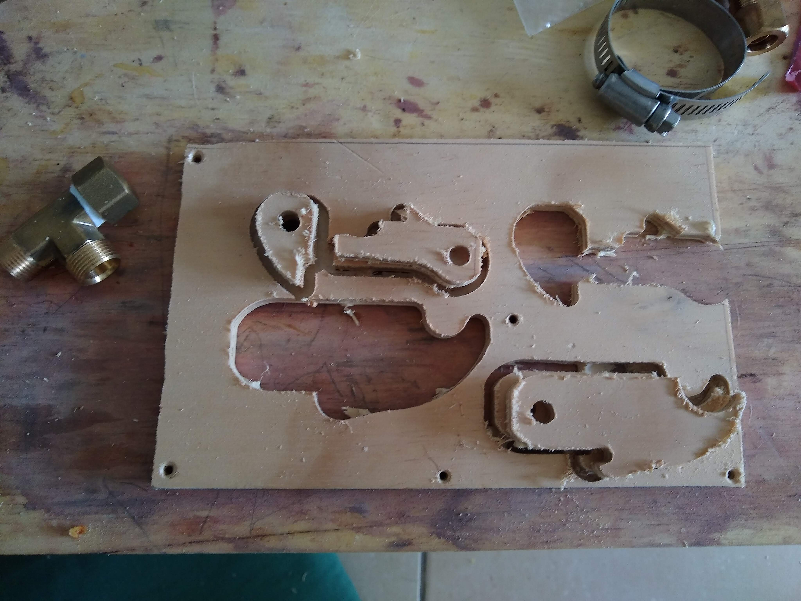

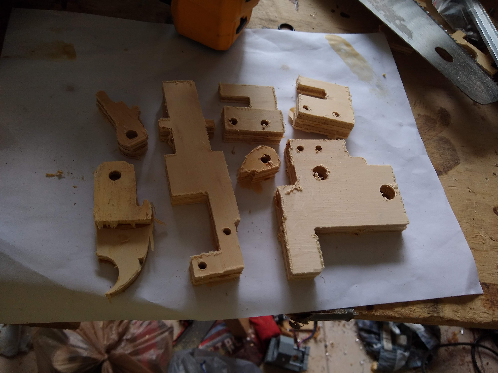

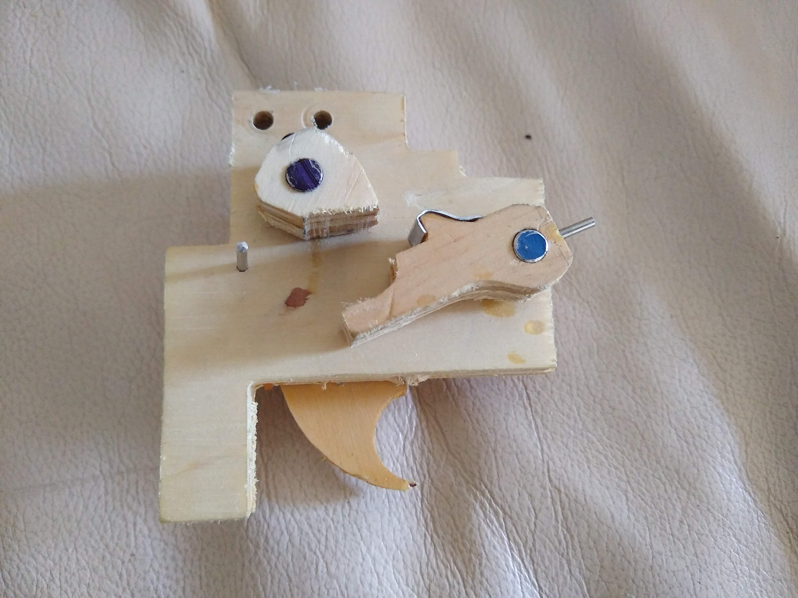

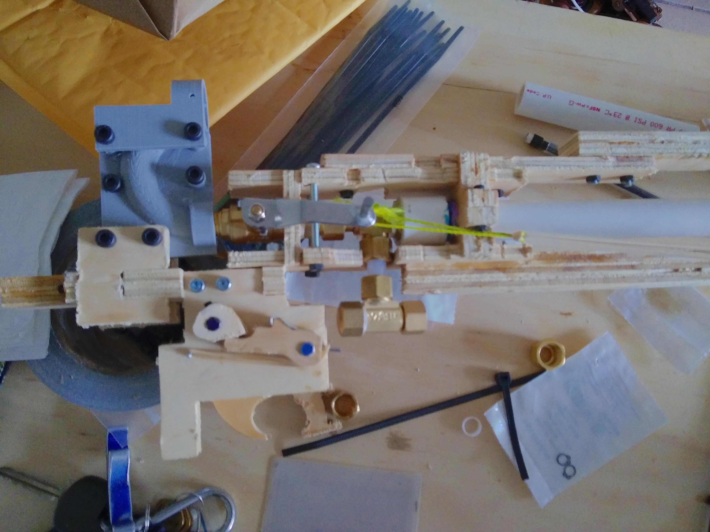

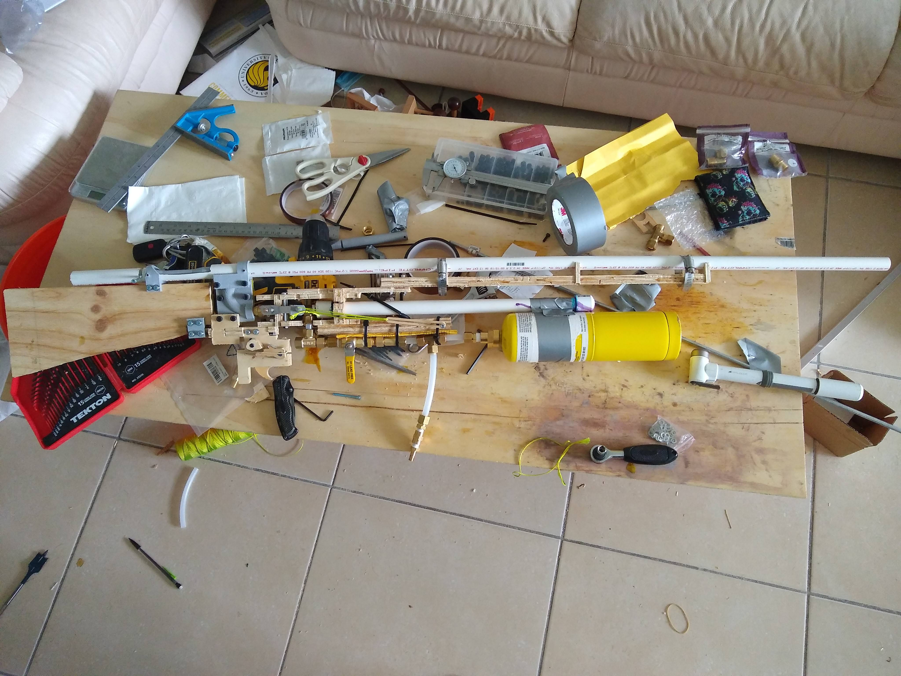

The first mechanism had a pesky habit of randomly going off by itself, so I made a second version that simplified things and made it a little more robust

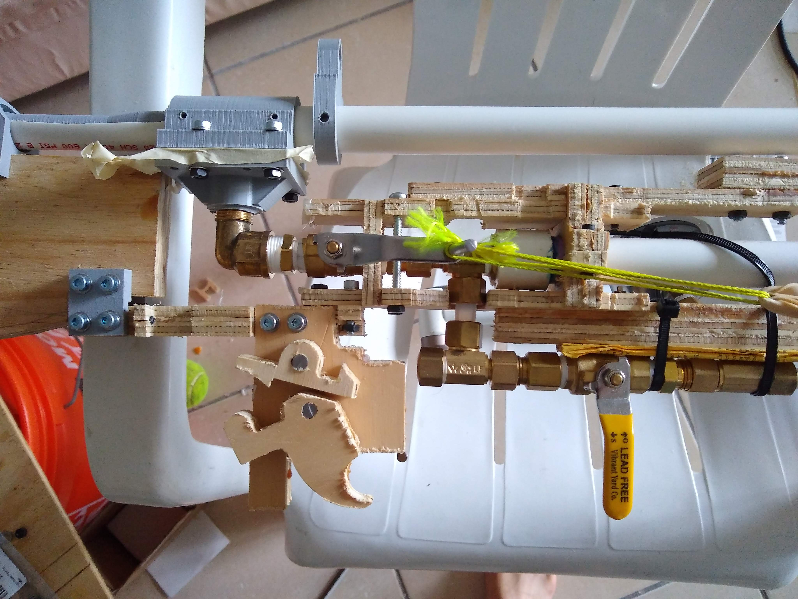

I also simplified the connector between the pipe and the barrel to improve the chances of a good seal, and added a simple 3D printed sight.

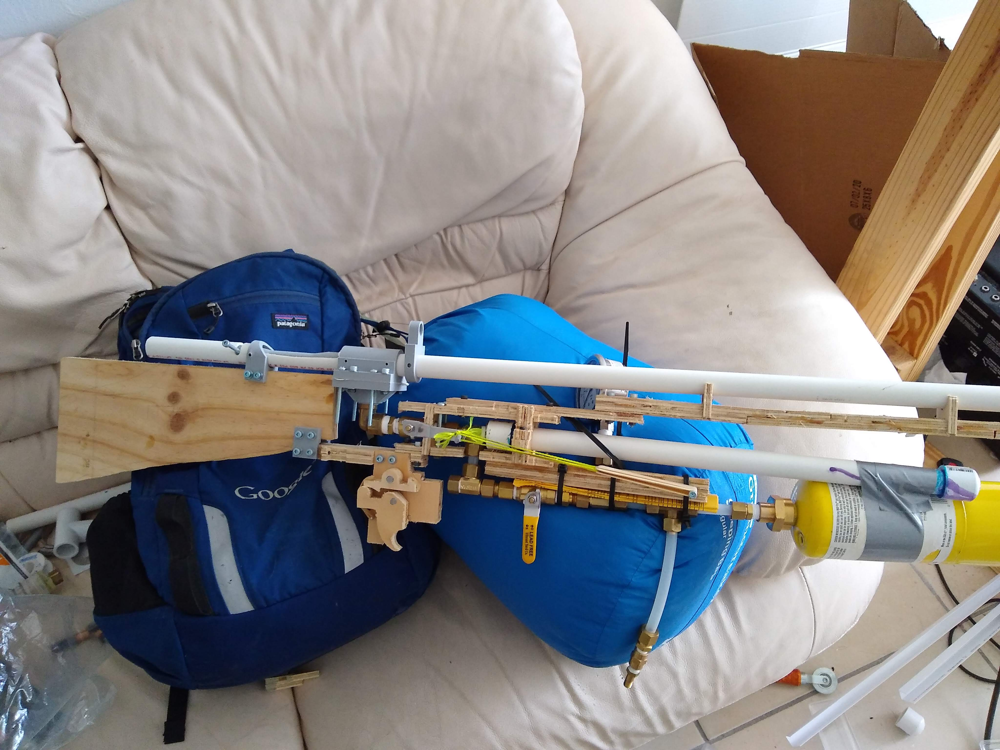

# Future work
While I was working on this design over the span of several weeks over several months, it turns out my brother bought his own high end nerf gun, which shots marginally less powerfully than this one, but is much much easier to use.
So obviously I need to try to beat that one next year
