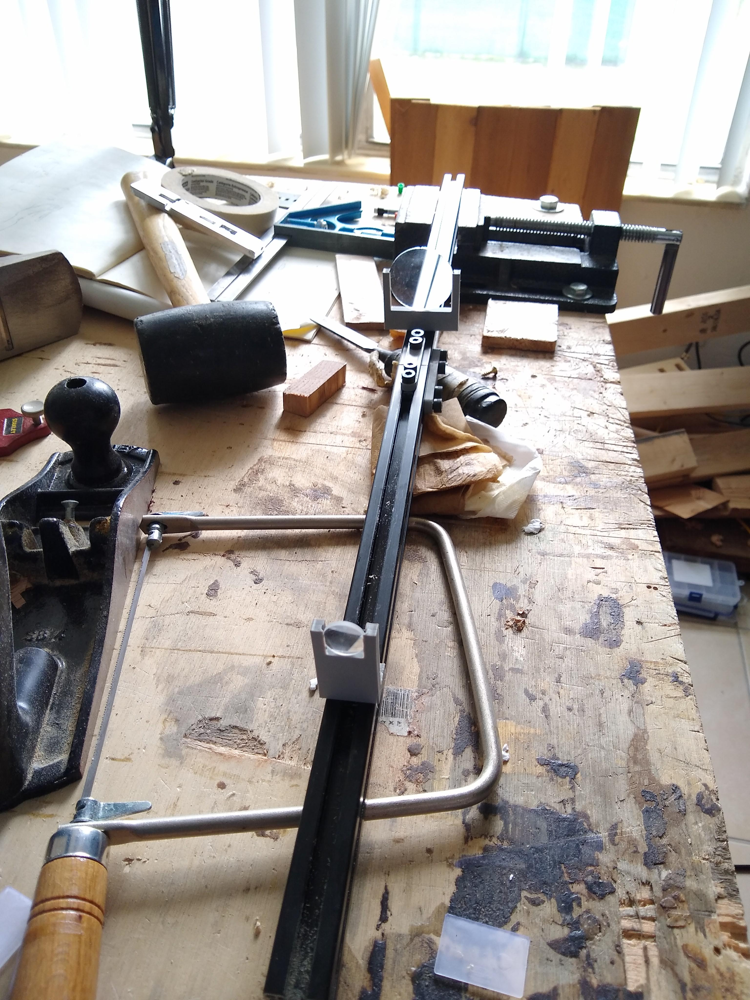
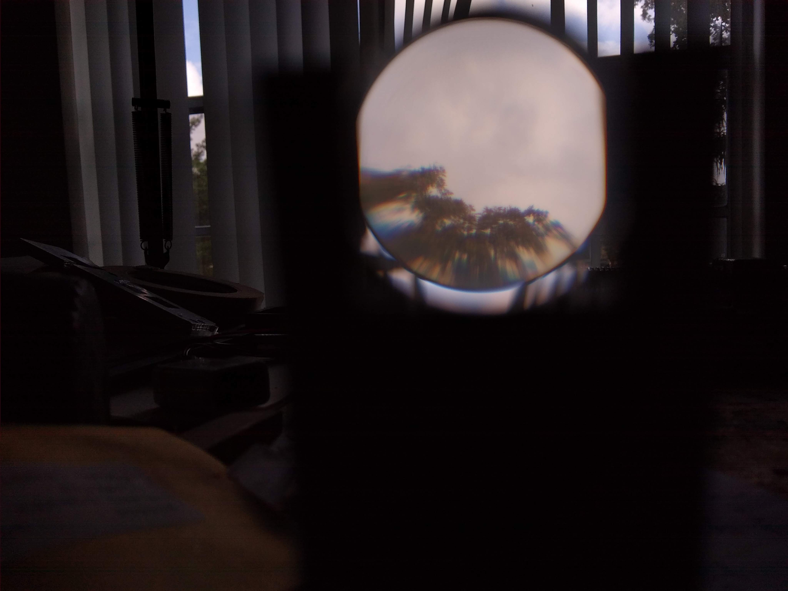
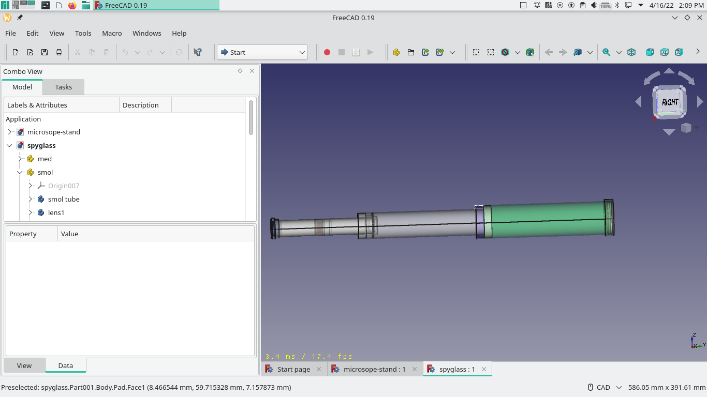
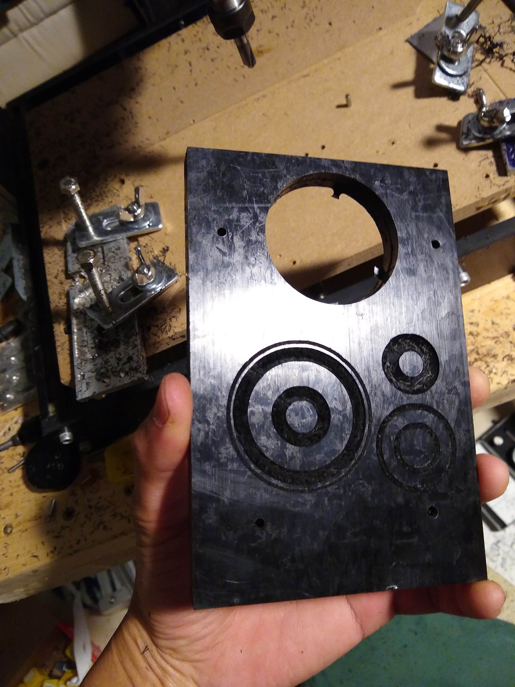
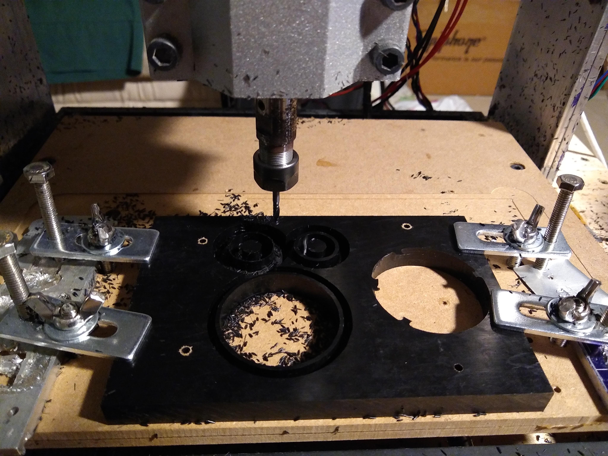
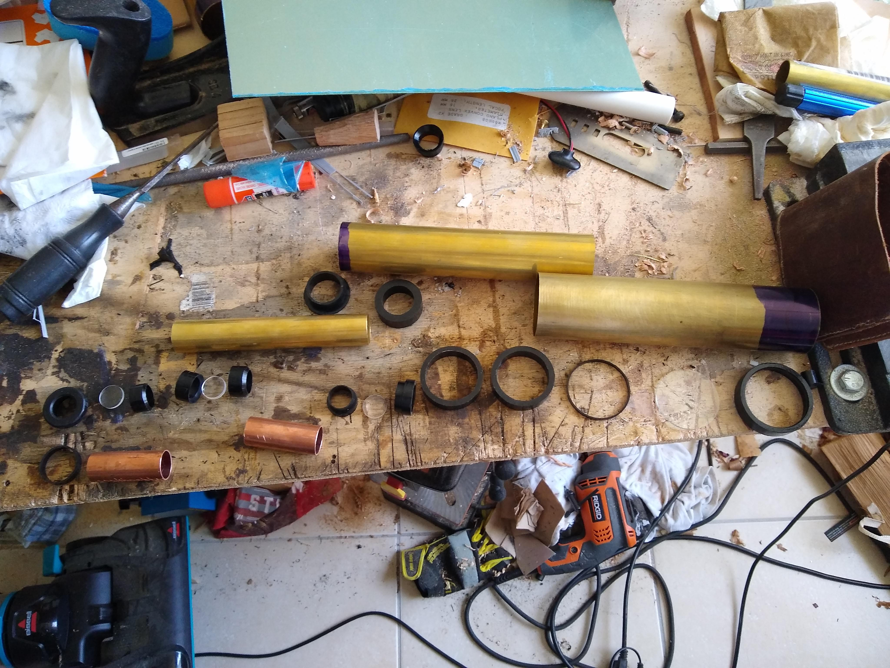
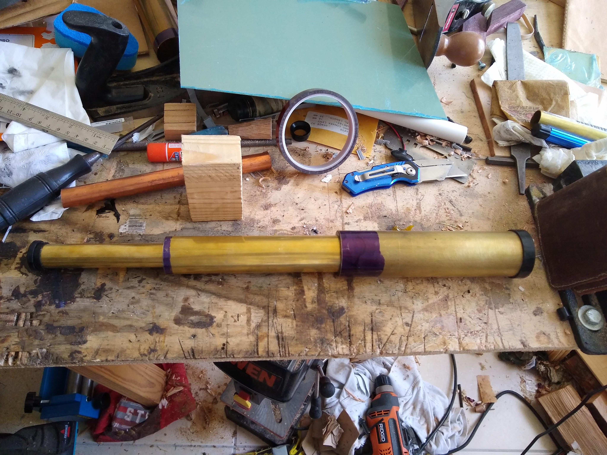
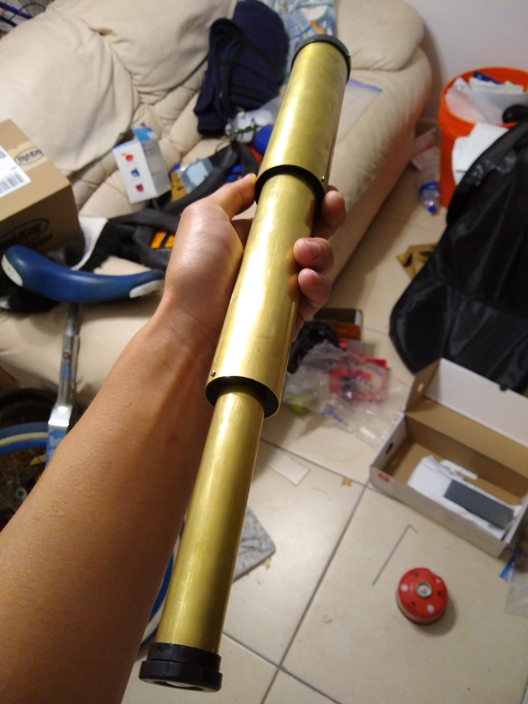
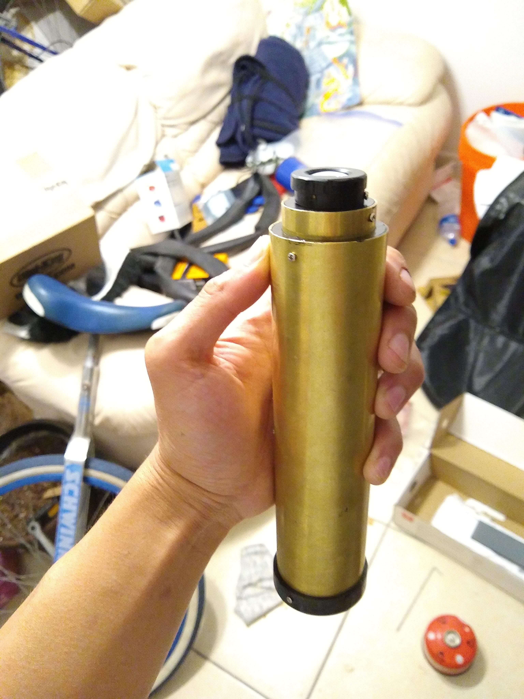

So a lot of my friends recently got into sailing, and I decided I'd make them all spyglasses as a nice gift.
Unfortunately two of them found their own, much higher quality optics while I was working on designing the spyglass, so I only had to make one of them.
At the end is some daydreaming on optical model optimization

# Design
I always had the impression that optics was an incredibly exacting field that was expensive to get into, and that turned out to be basically true.
My initial approach was to try to find the cheapest arrangement of off the shelf lenses that could work, and this led me to using Edmund Optic's clearance bin, which sells experimental grade (read chipped, more loosely toleranced) lenses at a pretty staggering discount (down to $3/lens compared with $20+)

So I ended up copying the lens design from spyglasses made in the 1600's.
I eventually found the great ["The History of Telescopes and Binoculars: An Engineering Perspective"](Binoculars-and-Telescopes-Proceedings-8129.pdf), which showed that one of the better early systems was the Schyrle Erecting System.
How this worked was that the objective lens brought an image from far away (approximately infinitely far away) to a focus.
This is followed by what's called a relay couplet, a pair of lenses that ideally don't affect the image but merely allow it to pass some distance unaffected but also flips it over.
This is followed by the eyepiece, which both inverts (uninverting the image) and magnifies the image.
The magnification of this kind of system is simply the ratio of the focal length of objective lens over the focal length of the eyepiece.
The distances between the lenses are equally easily determined, look at the article posted above.
So it gets a little more complicated than this.
Lenses suffer from multiple kinds of imperfections, the most obvious ones here are spherical aberration and chromatic aberration.

Spherical aberration comes from the fact that spherical lenses aren't the perfect lens geometry, and light coming from further away from the center of the lens ends up focusing at a different focal length than light from the center of the lens.
This leads to the image being blurry even at the focal point, and adds coma (blurry stretching) to the outer parts of the image.
This can be reduced by maintaining a high focal length to lens diameter ratio, which reduces the change in angle from the edge of the lens compared to points closer to the center.
So we can either use smaller diameter lenses, sacrificing field of view, or use lenses with longer focal lengths, making the entire spyglass longer.

Chromatic aberration comes from dispersion, the fact that the index of refraction of the lenses changes with the wavelength of the light, so that red light focuses at a different point than blue light coming from the exact same angle.
This is what leads to the colorful bleeding around the edges in some lens systems.
Properly dealing with this involves using a mix of different glass types so that the dispersion cancels out in the entire system.

If you can't guess all these are very complicated to model so I just bought the lenses and stuck them in a test stand to adjust stuff until it looked decent.
The test stand's just some aluminum extrusion I had lying around with a bunch of 3D printed parts mounted to it.
I'm working on eventually going back to this and redesigning the system the right way, using a properly optimized optical design and custom ground lenses, but I've got a lot more studying to do before that point.

The image wasn't exactly _good_ but it looked old timey and you can kind of see stuff

## More design
The article above mentioned a lot about the construction of spyglasses, and I stole a lot of these ideas in this design.
I modeled the design in FreeCAD to make sure the dimensions line up correctly, this was definitely the most complicated thing I've had to model at that point.
It ended up being a three tube design, using brass for the outer tubing and CNC milled acetal milled to act as the draws the tubes slide into each other on, and even more milled acetal to hold the lenses in place.
Copper tubing was also used as spacers in the eyepiece assembly, and the various tapers in the assembly were there to hopefully help the parts center themselves when it was assembled.

The mounts for the lenses in the eyepiece were designed to form a stack that could be pushed into the eyepiece, screwed in place on one end, and then tightened down and screwed in place in the other.
The objective lens mount ended up being a little more interesting. It consisted of a larger outer piece that fit on the outside of the brass tube but also had a small enough inner diameter to keep the objective lens from escaping, and an inner ring that would slide into place against the lens and provide pressure to keep it in place.
Both of these would be held in place with a pair of screws that would both hold the outer piece against the brass tube, but would also push against a taper in the inner ring that would then hold the lens in place.

Traditionally, the lens mounts and the like would have been threaded into the brass tubing.
I (at the moment) don't have a lathe so I ended up using these absoutely tiny self tapping screws, which will soon cause me quite a few minor inconveniences.
Anyways, now it's time to do a lot of machining/machining adjacent things.

# Construction
This project was meant to be a good introduction for myself into the world of (sort of) precision machining, and I definitely learned a lot about proper fixturing and generating CNC code from models in FreeCAD.
This precision was absolutely necessary because I needed to get a sliding fit between all three of the tubes, and maintain proper lens spacing to make sure it can still get an image.
A lathe would've made things much easier and probably provided a better finish, but I've already invested way too much time into getting that CNC running so I needed to get some work out of it.

TODO fixturing and CNC pics here

It turns out a big part of CNC milling is figuring out how to pack all the pieces together so they can be cut out with minimal waste.
I managed to fit some of the parts for the smaller eyepiece tube assembly inside parts used by the objective tube assembly.
All the parts were designed so they could be cut using only two mills, a 3mm end mill and a 45 degree chamfer end mill.

Most of the parts could be made using a one sided operation, but some of them needed operations on both sides.
To do this, I needed a way to accurately maintain the position of the workpiece when it's flipped over for the second operation.
I chose to use a set of four symmetrically located dowel pins to do this, and it worked fairly well.

# Experiments in electro etching
I first wanted to etch a logo into the side of the main brass tube, fill the etched area with silver solder, and grind it back into flat to get a nice silver image into the spyglass, but getting the etching process to work well was trickier than expected, and I was already taking way too long on this little project so I went with a simpler approach.

I had the design converted into a vinyl sticker, and stuck that on the tube.
If I were to etch it using the sticker as a form of etch resist, I'd be etching the negative of what I want.
So to get the the etch resist in the proper place, I filled in the space around the vinyl sticker with nail polish, waited a little bit for the nail polish to dry, and then removed the vinyl sticker, exposing the area under the vinyl sticker rather than the area around it.
I used a sponge soaked in brine solution to act as the electrolyte and a piece of copper tape as the other electrode.

It turns out nail polish is not as resilient as I thought, and it started peeling during the electro etching process, so I had to stop relatively early.
After polishing the logo turned out okay, but it was nowhere deep enough for the silver soldering approach I was talking about before to work, so I left it as is

# Final assembly
Here's a few of the cooler shots during assembly:

The inside of each tube was spray painted with black matte paint to reduce the amount of stray reflections.
Some of that perfect black paint with carbon nanotubes or whatever in it would've been nice here

It was so satisfying to polish the final surfaces down to an almost mirror finish.
It kind of ruined the fit between the eyepiece tube and the middle assembly but it was totally worth it:

Like I mentioned before, these tiny screws ended up being mildly bothersome.
It turns out being less than a millimeter in diameter means it is very easy to both strip the head and also just torque them so much they snap in half.
This means the little screws are effectively one time use, because there's no guarantee that the stress from the first use won't cause the screw to break when you try to reuse it.
This happened several times, so now there's one broken screw stuck in the eyepiece that I'll eventually need to get out if anything breaks in it

# Further work, simulation and optimization
Eventually I want to go back to this and build at least a better eyepiece assembly, because it seems like the eyepiece is the source of a lot of the aberrations in the image.
I started working on modeling the system more accurately using `ray-optics`, a Python library developed by some apparently very famous member of the optical engineering community.
After studying enough of the source code and examples to understand how it worked, I managed to write a [model of the original spyglass in a Jupyter notebook](https://git.threefortiethofonehamster.com/kelvin/spyglass/src/master/spyglass.ipynb).
It correctly predicted that my optical design does indeed suck

`ray-optics` works great for the things it can do, but it does have some rough edges that I wrote utility functions for.
For example, there's no way to get the focal point of an optical system.
You can get the focal point of the paraxial model of the system, which is basically a small angle approximation of the system based on assuming all the elements act ideally, but I've noticed that the ray traced focal length can differ pretty drastically from this point, and that can mess with the figure of merit measurement of the system.
I wrote a little function that finds its true focal point by using the rays output by the ray tracing set, stepping along a lot of z values and picking the one that minimizes the spread of the rays.
This could probably be done faster by dynamically the step size as you try different focal distances, but it runs fast enough and still provides more accuracy than I can physically adjust to, so I'm leaving it as is.

So professional optical engineering work is done by feeding in approximate model of the system you want to create, and letting the software optimize the parameters of the system, ie. the curvature of the lenses, distances between lenses, etc. to produce an optimized version of the system that can be used.
`ray-optics` by itself doesn't provide this, but it gets me far enough I think I can cover the remaining bit of work with a little bit of custom code.

To optimize a system I first need a way to score the system to measure its performance and provide feedback to drive the optimization.
At the company I currently work for, the optics engineers use the RMS error of the rays hitting the image plane to determine optical quality.
They'll simulate rays from various angles and different wavelengths and use a weighted score of the RMS errors of each scenario as the score function.
If this error is less than the size of the Abbe disk, the system is considered diffraction limited and your image quality is basically limited by the physics of the system rather than by its design, weird wave effects start happening there and will crowd out the RMS error your ray tracer is giving you.
I can generate the same score using `ray-optics`; it's already used in my focusing function to determine where the system's true focal point is.
So given a set of rays traced from the object through the system to the calculated image plane, I can get a measurement of how clear the image is.

So it turns out I need to optimize my optimizer.
I've tried some small experiments to brute force the optimal lens distances in my spyglass design, but the ray tracer is just too slow and makes iterating on the system too painful.
Fortunately there was plenty of room to improve it without any algorithmic level changes, and I managed to get around a 30x speedup [here](https://git.threefortiethofonehamster.com/kelvin/spyglass/src/master/faster%20raytrace.ipynb).
The original ray tracing function was made very generic so it could work with a (maybe too) large set of element designs.
It also did each ray individually, which in pure Python would be very inefficient.
With some minor changes I rewrote enough of the ray tracing code to use numpy to trace all the rays at once (internally using a much faster C loop), while supporting only spherical lens elements (and mirrors because it was easy enough to add them in).
There's still some room for improvement here.
It still feels like the overhead from Python calling into numpy is a large factor here, so modifying the ray tracer further so that it can calculate trace rays for multiple versions of the same model within the same numpy invocation would probably provide even more speedup.
Maybe eventually moving into GPU processing would make sense, but it'd probably take a lot more rays than the paltry ~10000 or so each run uses right now to make up for all the additional GPU setup time.

So now I've got a sufficiently fast means to go from a model to a figure of merit, now I just need to write the optimizer that can vary the model to find the optimal one.
Optical systems, at least the ones that I'm look at, tend to have reasonably low numbers of variables, and the few experiments I've done looking how changing focal length of lens distances affects image quality seems to indicate the performance metric is relatively well behaved.
This means a simple gradient descent optimizer should work fine.
I'll get around to writing one up after studying up on optical design a little more so it has a modern design with a better chance of cancelling out some aberration to start off with.
