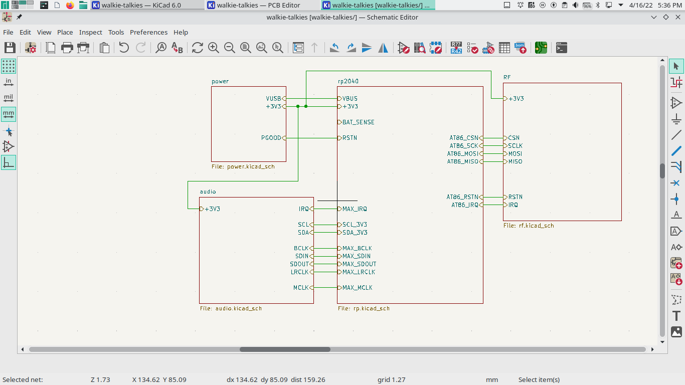
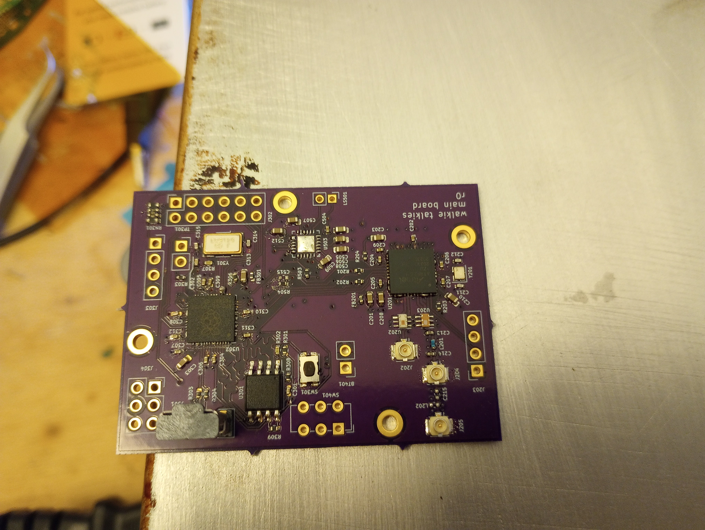

I could just buy a pair of walkie talkies, but building them from scratch is way more fun.
I'm hoping I can do an all-digital design, which should hopefully have better range and some other cool features whenever I come up with them

Code/schematic/whatever's [here](https://git.threefortiethofonehamster.com/kelvin/walkie-talkies)

# Design
I'm aiming to fit it in an Altoid tin with integrated speaker and microphone, power it off a 9V battery, and have it transmit in the 915MHz ISM band

## Hardware (main board)

There are only three major chips involved, the RP2040, which is the dual core ARM chip that's going to be doing all the processing, the AT86RF215, which is a very nice RF transceiver, and the MAX9860 to do all the audio-related hardware stuff.
The RP2040 will be talking to the AT86RF215 using SPI and to the MAX9860 using I2S.
I haven't really figured out the exact details for the UI yet, so that's been shoved off to another PCB that I'll have to do down the line.

The Raspberry Pi RP2040 is really nice, it's only $1 for a dual core 100 MHz+ chip with plenty of peripherals to work with.
The only downside is that it needs an external Flash chip and is in a kind of big package

The AT86RF215 has raw I/Q LVDS output that I won't be using in this project, but I've broken out the interface to use in a future project.
It's also dual band, so it could be useful for stuff in the 2.45 GHz if I ever want to play around there
There aren't many mid end RF transceivers that provide the same sample rate and receiver performance as this guy so I'm going to keep a few of them around for experimenting

### Power
It's a pretty simple buck converter down from 9V (or 5V from USB) to 3.3V, which is regulated down to 1.8V twice for the digital and analog supplies of the MAX9860.

## Software
Sending the 12-bit 48 kHz audio data directly from the MAX9860 would use way too much bandwidth, so we're going to need to use some compression/decompression happening to get it down to a reasonable bitrate.
We're going to using the latest in low latency, lossy audio compression technology (that I think I can fit in this little 133 MHz process), `libcelt`!
It uses a modified discrete cosine transform to transform the audio into the frequency domain, where it mercilessly quantizes the data based on frequency range using pyramid vector quantization, and what's left is encoded as tightly as possible using a range encoder.
I just got the boards to successfully power up with catching fire so I'm really hoping this is performant enough on this little chip.
I'll probably be running the compressor on one core and the decompressor on the other to maintain full duplex communication

The RP2040 doesn't have native support for I2S, but it does have PIO, which lets you write your own finite state machine that'll be running at main clock speed on some specified set of GPIO pins.
There's already an example of PIO code for running unidirectional I2S, so it hopefully shouldn't be too hard to make one that can work with the weird bidirectional I2S the MAX9860 wants.

We're going to using a lot of DMA in this firmware.
This should allow data to be fed into/from both the AT86R215 and the MAX9860 without distracting the ARM cores from encoding/decoding audio data, and there should be plenty of RAM to support several full buffers if needed.

### RF protocol design
One interesting challenge in this design is that I'm going for full duplex communication, meaning data is flowing both ways when there's communication.
They'll be transmitting and receiving on the same frequency, and neither transceiver can transmit and receive at the same time, so they need a way to coordinate to know when they should be listening and when they should be receiving, so they're not both transmitting at the same time.
This can probably be solved by some form of random back off, but thinking of a more deterministic approach is always interesting

# Rev 0 notes

It's looking pretty good so far, got first successful power up after burning through two chips because of some shorts during reflow soldering.
The USB-based programming is so nice compared with the JTAG/SWD programming I'd normally have to deal with, and it's very fast too!
I'm leaving the USB connection enabled as long as I can into development.
The Pico SDK is an **absolute** pleasure to work with, they integrated so well with CMake, although that kind of pollutes CMake so I can't compile for the host system in the same CMake file.
I've worked around this so far by having a separate CMakeLists.txt in a subdirectory for running tests compiled on the host platform

Mistakes so far:
- SPI pins for the AT86RF215 are wired backwards, should be an easy bodge job to fix it
- The IS25SLP128F Flash chip does not seem to work with default settings with the RP2040. This is definitely a debuggable issue but I'm going to stick a pin in it to get to back to after I get this working
